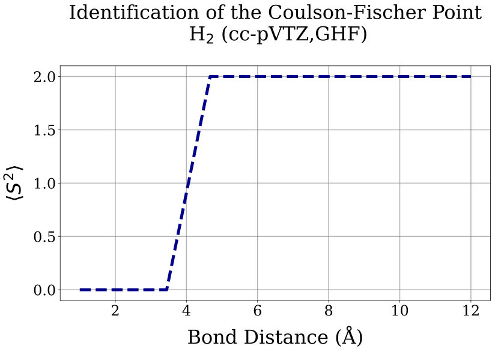
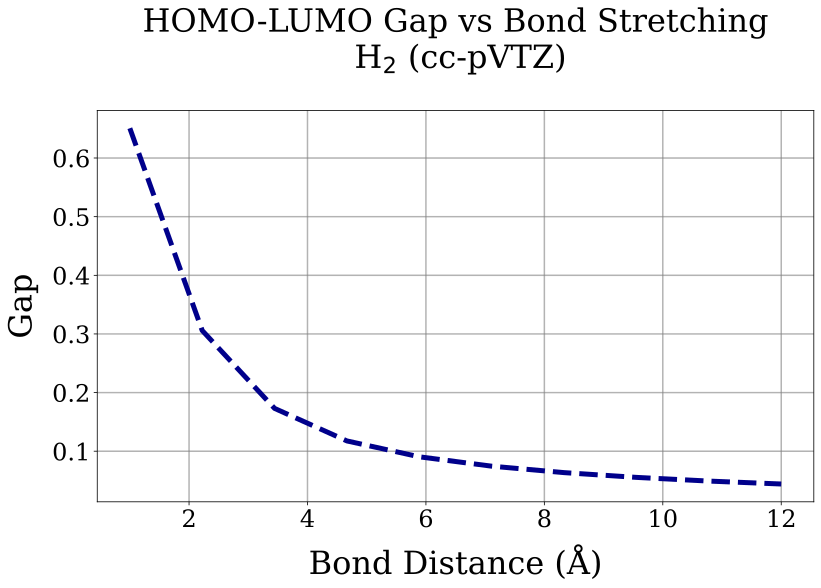
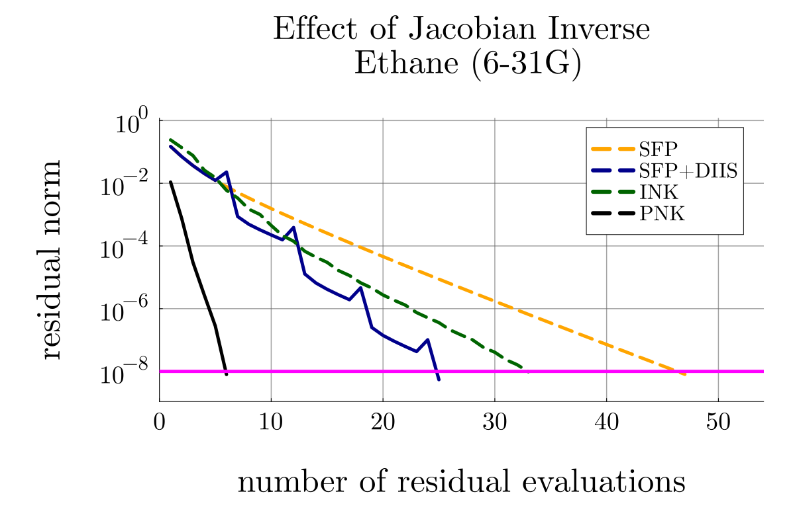

# Plot Analysis

## 1) Effect of Regularization
## a) Identifying Coulson-Fischer Point for dihydrogen

### Question
At which bond distance the spin symmetry breaks?

### Hypothesis
Few angstroms away from the equilibrium we will see <S^2> becomes non zero.

### Details
- System: H2
- Intialization: GHF
- Units: Angstroms

### Obeservation
Spin symmetry breaks after stretching the bond beyond ~ 5 Angstroms.

## b) Effect of bond strectching to the HOMO-LUMO gap for dihydrogen

### Question
Does near CF point the HOMO-LUMO gap becomes smaller and become worse afterwards?

### Hypothesis
- Near CF point the gap should be small and further away from the point it should become even smaller.

### Details
- System: H2
- Intialization: RHF
- Units: Angstroms

### Obeservation
- Near CF point the gap is ~ 0.1.
- Away from CF point it becomes smaller.
- Around 20 angstroms the gap bemoes larger (I don't know why)

## c) Effect of Regularization

### Question
How effective is regularization (level shift) for the convergence and convergence rate for a small-gap system, and how does it compare to INK?

### Hypothesis
- FP should diverge.
- SFP and INK should converge.
- INK should converge at a faster rate.

### Details
- System: H2-CF at 7 Angstrom, cc-pVTZ (small-gap case)
- Gauge: MO

### Observation
- FP suffers for few iterations with having amplitude difference ~ 1 in 2 norm and then diverrges.
- SFP took 46 iterations to converge.
- INK showed few fluctuations at start and then took 31 iterations to converge.

- For a system: H2-CF at 10 Angstrom, cc-pVTZ (evensmaller-gap case) any of the solvers does behave as usual.
- PNK, SFP, SFP+DISS converge to different soltuions.
- PNK converge to diffent solutions with different rates when appiled to different gauges.

## 2) Effect of Gauge

### Question
How sensitive are FP and INK to gauge choice (MO, AO, random) for a large-gap system?

### Hypothesis
- FP should converge in MO and diverge in AO and random (assuming bigger rotaion from MO).
- INK should converge in all gagues with same numbers.

### Details
- System: Ethane, 6-31G (large-gap case)
- Gauges compared: MO, AO, random gauge

### Observation
- FP converges only in MO.
- INK converges in all gauges with same numbers. 
- FP converge faster compared to INK in MO basis. (My guess is the samml shift I apply to FP to avoid zero divisions would do the this)

## 3) Effect of Jacobian Inverse 

### Question
What is effect on the convergence and the rate based on how exact are we constructing the Jacobian and how we construct it?

### Hypothesis
- All solvers should converge.
- SFP should be solver than INK. 

### Details
- System: Ethane, 6-31G (large-gap case)
- Gauges compared: MO

### Observation
- All solvers should converged.
- PNK was the fastest. 
- SFP was the slowest.
- INK was faster than SFP but with DIIS SFP is faster than INK.

## 5) Effect of Preconditioning

### Question
What is the effect on NK by preconditioning in an arbitrary gauge?

### Hypothesis
PNK should be faster than NK.

### Details
- System: Ethane, 6-31G (large-gap case)
- Gauges compared: Random

### Observation
- PNK is significantly faster.