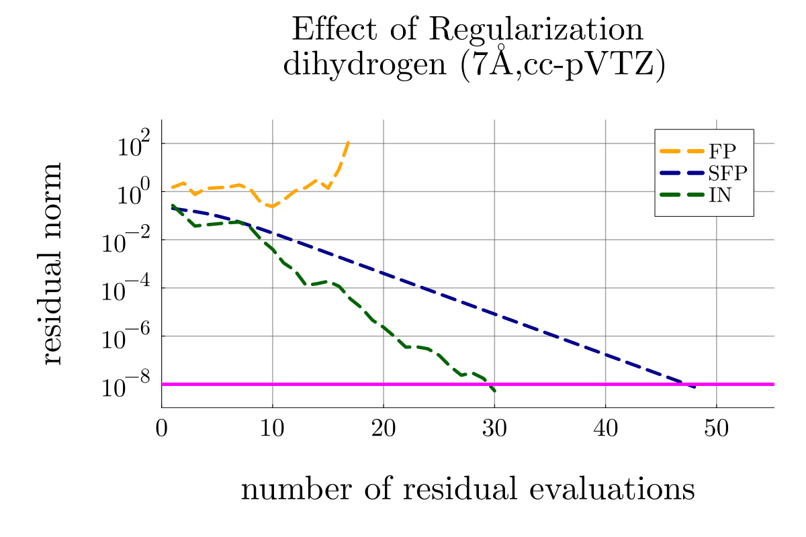
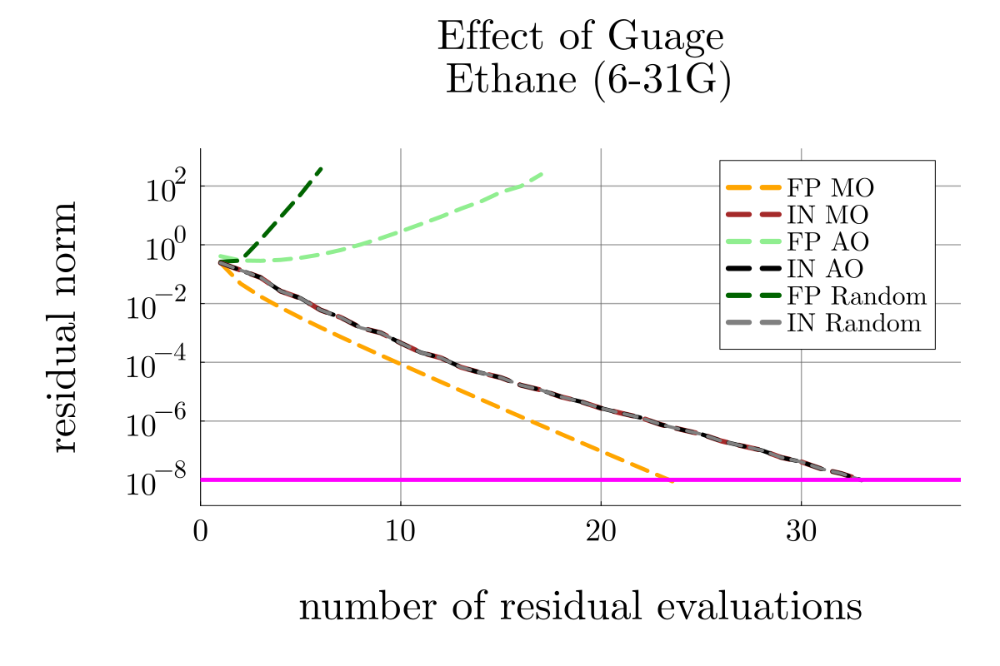
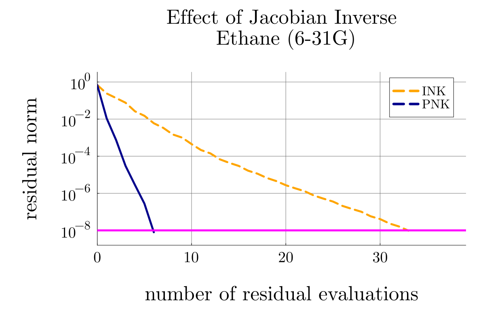
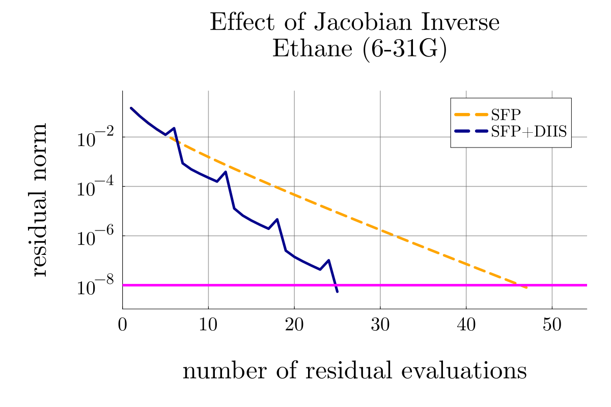
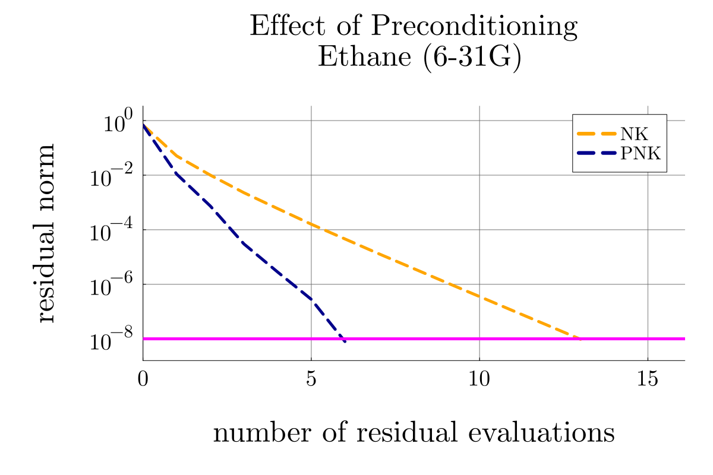

# ARCC Plot Analysis

This note summarizes the controlled studies requested in the roadmap.

## 1) Effect of Regularization

### Question
Does regularization (level shift / ridge-like stabilization) improve robustness for a small-gap system, and how does it compare to INK?

### Hypothesis
For a small-gap case, unshifted FP should be unstable or slower, while shifted FP (SFP) should be more stable; INK should remain robust without needing explicit regularization.

### Details
- System: H2-CF at 7 Angstrom, cc-pVTZ (small-gap stress case).
- Gauge: MO (identity transformation in the test setup).
- Curves intended by test design: FP, SFP, INK.
- Relevant script: test_effect_of_regularization.jl.

### Conclusion
The regularization study is conceptually aligned with theory: SFP should improve over FP in a small-gap regime, and INK should be robust.

Observed implementation issue:
- The script saves SVG to rffect_of_regularization_...svg (typo), which is likely unintended.
- The expected effect_of_regularization figure is not present in the current figures folder.

So the hypothesis is theoretically correct, but the plotting/output naming appears to have a bug or mismatch in generated artifacts.

## 2) Effect of Gauge

### Question
How sensitive are FP and INK to gauge choice (MO, AO, random) for a large-gap system?

### Hypothesis
INK should be comparatively gauge-robust; FP behavior should vary more with gauge because its effective preconditioner is naturally tied to MO structure.

### Details
- System: C2H6, 6-31G (large-gap case).
- Gauges compared: MO, AO, random orthogonal gauge.
- Curves: FP(MO/AO/random) and IN(MO/AO/random).
- Relevant script: test_effect_of_gauge.jl.

### Conclusion
The study design directly answers gauge sensitivity. If IN curves remain close across gauges while FP separates more, that confirms the roadmap claim that Newton-type methods with better linear solves are more gauge-stable. That outcome is expected theoretically, not a bug.

## 3) Effect of Jacobian Inverse (Newton Family: INK vs PNK)

### Question
Does a better Jacobian-related solve strategy (PNK structure) reduce residual faster than INK under the same conditions?

### Hypothesis
PNK should converge faster or with fewer residual evaluations than INK due to more effective Krylov/preconditioned linear treatment.

### Details
- System: C2H6, 6-31G.
- Gauge: MO.
- Curves: INK vs PNK.
- Relevant script: test_effect_of_jacobian_inverse_nk.jl.

### Conclusion
If PNK drops faster than INK, the hypothesis is correct and consistent with the roadmap claim that PNK is close to optimal in practice. This is expected from theory and indicates no obvious bug.

## 4) Effect of Jacobian Inverse (Fixed-Point Family: SFP vs SFP+DIIS)

### Question
In the FP family, does DIIS acceleration (approximate Jacobian inversion in Krylov-like space) improve convergence over plain SFP?

### Hypothesis
SFP+DIIS should generally outperform SFP in residual reduction speed.

### Details
- System: C2H6, 6-31G.
- Gauge: MO.
- Curves: SFP vs SFP+DIIS.
- Relevant script: test_effect_of_jacobian_inverse_fp.jl.

### Conclusion
If SFP+DIIS converges faster, this supports the theoretical picture that DIIS acts like an approximate Jacobian inverse in an iterative subspace. That is expected behavior, not a bug.

## 5) Effect of Preconditioning

### Question
How much does explicit preconditioning help Newton-Krylov in a non-canonical (random gauge) basis?

### Hypothesis
PNK should be clearly more robust/faster than NK in random gauge because the preconditioner targets gauge-sensitive conditioning.

### Details
- System: C2H6, 6-31G.
- Gauge: random orthogonal gauge.
- Curves: NK vs PNK.
- Relevant script: test_effect_of_preconditioning.jl.

### Conclusion
A clear PNK advantage would confirm the roadmap statement that the correct preconditioner improves conditioning and supports gauge-invariant behavior of the effective linearized problem. This would be theoretically expected.

---

## Overall Verdict
- The controlled-study structure matches the roadmap very well.
- The main likely issue is artifact naming/output consistency in the regularization script (notably rffect_of_regularization typo and missing expected figure file).
- For gauge/Jacobian-inverse/preconditioning studies, results consistent with faster PNK or DIIS-accelerated behavior are expected and theoretically justified.